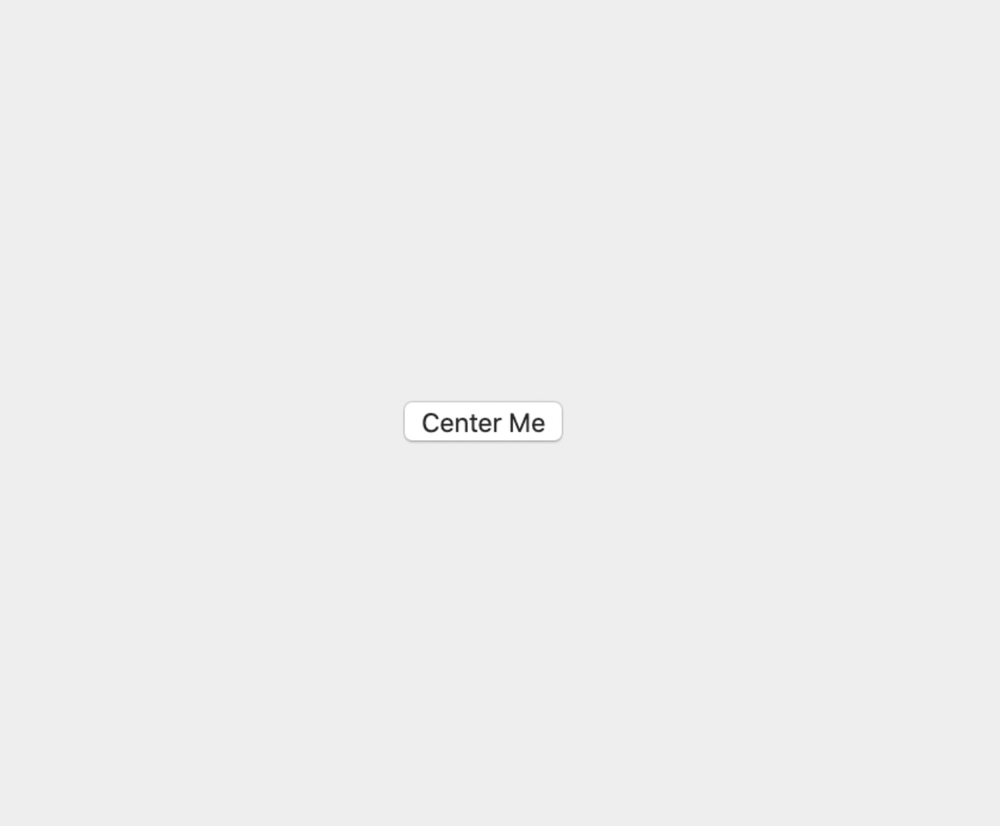

# CSS Flexbox 

Flexbox makes it easier to build page layouts that are dynamic. As the designer of a web page, you can designate some parts of your page to automatically resize depending on window size, filling empty space in a way that you specify. It is also very useful for displaying columns or rows of items, keeping items evenly spaced regardless of their individual sizes, or allowing them to wrap to a new line cleanly.

In this lesson, we will discuss some of the common ways to use flexbox and the associated properties you can use while coding through some examples. Feel free to code along using the provided html files.

## Objectives 
1. Setting up a **Flex Container** 
2. Identify and use **Flex Properties** 

#

## Getting Started 
- Clone ths directory by running the following command inside of your terminal: 
    - `git clone https://github.com/DigitalCraftsStudents/css-lab-flexbox-practice.git` 
- On your terminal command line, navigate into the cloned directory: 
    - `cd css-lab-flexbox-practice` 

# 
## `Center Button` 

Centering items is one of the most useful abilities Flexbox offers. 

- Open the file `centerButton.html` 
- Create a container that's 500px by 500px
- Center a button directly in the center using Flexbox (see screenshot).

Expand to see Screenshot

#

## `Three Column Layout` 

Create a simple three column layout with numbers centered on each column. 

- Open the file `centerButton.html` 
- Create the layout in the screenshot below

Expand to see Screenshot

#
## `Chessboard` 

Create a chessboard using Flexbox.

- Open the file `chessboard.html` 
- Define 64 cells and wrap them around how ever flex containers are necessary
- Alternate the items' background colors (`#ffce9e` and `#d18a46`) using your CSS knowledge
- Display the items in a 8x8 grid using flexbox

Expand to see Screenshot

#

## `Navigation`

- Open the `navigation.html` file
- Recreate the navigation bar shown below using the provided HTML.

Expand to see Screenshot

#

## `Input Add-ons` 

- Open the file `inputAddOns.html`
- Create add-on for input fields that can be put before or after an input field (see screenshot). 

Expand to see Screenshot

#

## `Mondrian CSS Painting` 

Piet Mondrian is regarded as one of the greatest artists of the 20th century 

He is known for being one of the pioneers of 20th-century abstract art, as he changed his artistic direction from figurative painting to an increasingly abstract style, until he reached a point where his artistic vocabulary was reduced to simple geometric elements.

- Open the file `mondrian.html`
- Recreate the mondrian painting shown in the screenshot below

Expand to see Screenshot

